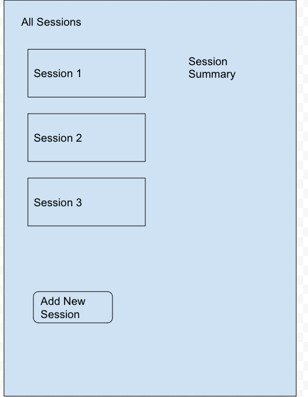
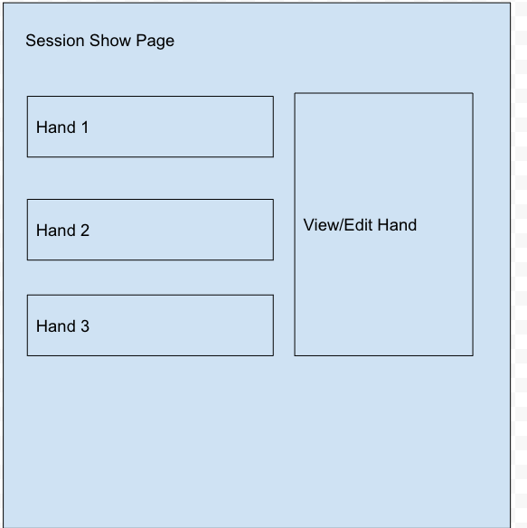

# Poker Hand Log
An app to keep track of hands of Texas Hold'em that you've played.

## User Stories

- As a User, I should be able to Create, Read, and Delete Sessions
- As a User, I should be able to Create, Read, Edit, and Update Hands
- When I click on a Session for more details, it should display all Hands that were played in that Session
- When I click on a Hand for more details, it should show me an edit form with the details pre filled.

## Diagrams

Show

## Issues
My main issue was time. I spent more time than I expected to on the backend because I had to teach myself how to use Flask with mongoDB.

Another issue I had was using npm. I don't know exactly what happened, but I think I made a typo while installing some dependencies.

## Future enhancments
- Add styling
- Add redirection
- A login page
- Refactoring with Redux
- A Search page to generate custom queries to send to the backend
- Implement graphs to visually display your performance over time